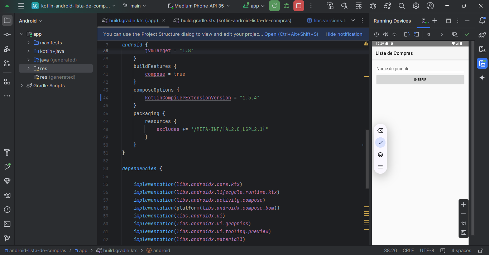
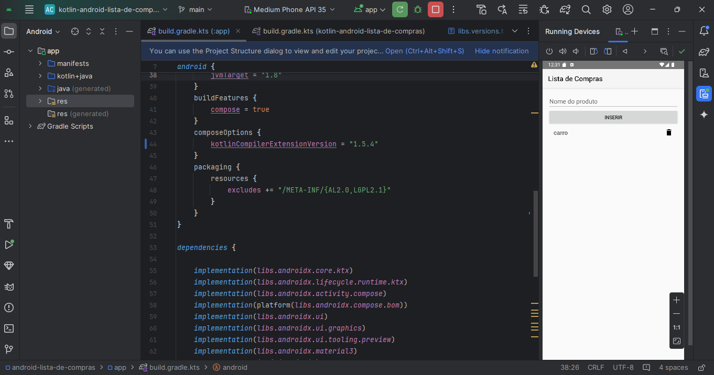

# 📱 Lista de Compras - App Android

Este projeto é um aplicativo de **Lista de Compras** desenvolvido em **Kotlin** utilizando **Jetpack Compose**. Ele foi criado como parte dos estudos e atividades da disciplina de desenvolvimento de aplicativos móveis.

## 🎯 Funcionalidades

- ✅ Adicionar produtos na lista.
- ✅ Visualizar os produtos cadastrados.
- ✅ Remover produtos da lista.

## 🚀 Tecnologias utilizadas

- **Kotlin**
- **Jetpack Compose** (UI moderna declarativa)
- **Android Studio**
- **Material Design**
- **Gradle (Kotlin DSL)**

## 💻 Como executar o projeto

1. Faça o clone do repositório:
```bash
git clone https://github.com/SEU_USUARIO/SEU_REPOSITORIO.git
```

2. Abra o projeto no **Android Studio**.

3. Conecte um dispositivo físico ou inicie um emulador Android.

4. Clique no botão **Run (▶️)** para executar o app.

## 🏗️ Estrutura básica do projeto

- `app/` – Contém todo o código-fonte do aplicativo.
  - `src/main/java` – Código Kotlin.
  - `src/main/res` – Recursos visuais (ícones, strings, temas).
  - `build.gradle.kts` – Configurações do Gradle.

## 📸 **Imagens do aplicativo**

### ✅ App rodando no emulador


### 🛒 Inserindo produtos na lista


### 🗑️ Deletando produtos da lista


## 🧑‍💻 Desenvolvido por

- Projeto base do professor disponível no repositório.
- Adaptado, configurado e executado por **Matheus Cerqueira** como atividade acadêmica.

## 📂 Observação
> 🔸 As imagens precisam estar salvas na pasta `/images` dentro do repositório para serem exibidas corretamente no README.
